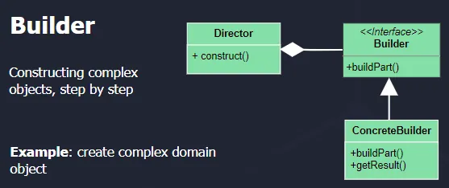
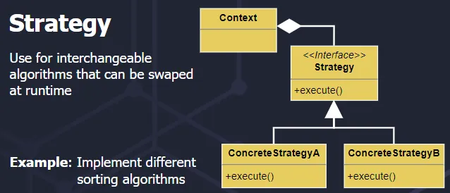

# Design patterns
## Design Pattern Categories

- Creational Patterns
  - Chain of Responsibility
  - Command
  - Interpreter
  - Iterator
  - Mediator
  - Memento
  - Observer
  - State
  - Strategy
  - Template Method
  - Visitor
- Structural Patterns
  - Adapter
  - Bridge
  - Composite
  - Decorator
  - Facade
  - Flyweight
  - Proxy
- Behavioural Patterns
  - Abstract
  - Builder
  - Factory
  - Prototype
  - Singelton

## Singelton

### Usage: 

Use when a single instance of a class is needed. Some examples are logging and database connections.

## Factory

### Usage:

Decouple object creation from usage. For example, you create different types of database connections based on configuration.

## Builder

### Usage:

Constructing complex objects step by step. For example, if you need to create a complex domain object.

## Adapter

### Usage:

Make incompatible interfaces compatible. For example, it integrates a new logging library into an existing system that expects a different interface.

## Composite

### Usage:

Represent part-whole hierarchies. For example, graphic objects in a drawing application can be grouped and treated uniformly.

## Proxy

### Usage:

Control access to objects. For example, lazy loading of a high-resolution image in a web application.

## Decorator

### Usage:

Dynamically add/remove behavior. For example, we are implementing compression or encryption on top of file streams.

## Strategy

### Usage:

Define a family of algorithms. For example, they allow users to choose different sorting or compression algorithms.

## Observer

### Usage:

Maintain a consistent state by being notified of changes and, for example, notifying subscribers of events in a messaging system.

## Command

### Usage:

Encapsulate a request as an object. For example, I implement undo/redo functionality in text or image editor.

## State

### Usage:

Encapsulate state-specific behavior. For example, we are handling different states of a user interface element (e.g., enabled, disabled, selected).

## Template Method

## Usage:

Define the skeleton of an algorithm in operation, deferring some steps to subclasses and implementing a base class for unit testing with customizable setup and teardown steps.

# Resources

- https://newsletter.techworld-with-milan.com/p/how-to-select-a-design-pattern?ref=dailydev
